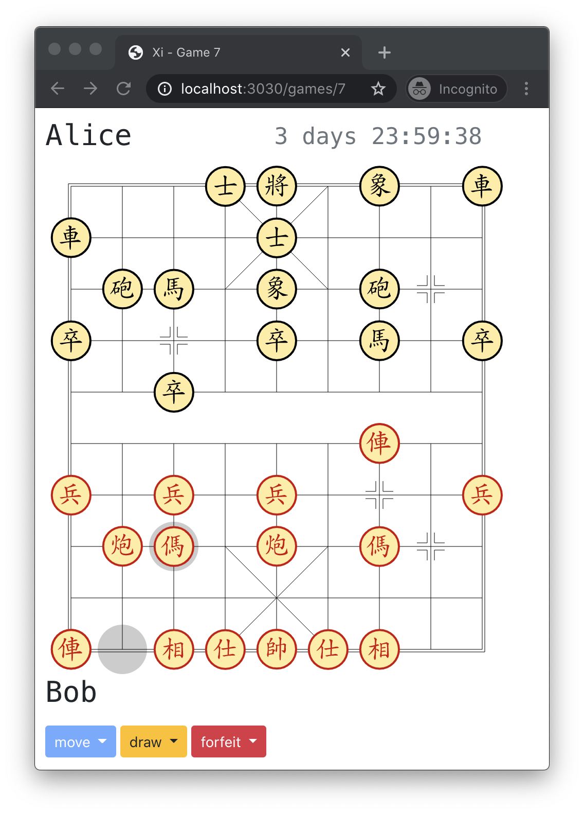

# Xi - Correspondance Chinese Chess 

[](https://circleci.com/gh/bkiers/xi)

A small [NestJS](https://nestjs.com/) app to play correspondence [Chinese Chess](https://en.wikipedia.org/wiki/Xiangqi).



## Getting started

To run the app on your local machine, do the following:

- copy `config/development.env_EXAMPLE` to `config/development.env` and adjust any values. The default values will work out of the box.
- add some sample data (users and a single game) to the database by running `npm run seed:run` (check the usernames and passwords in the seed files in `./seeders/*.js`)
- run the app by running `npm run start` and go to [localhost:3030](http://localhost:3030)

There is a single frontend controller (`AppController`) responsible for the hand full of views. The other controllers (`UserController`, `GameController` and `AuthController`) are API controllers and are available through the Swagger page [localhost:3030/api](http://localhost:3030/api).

When testing the API through the interactive Swagger page, be sure to login first, and set the auth token in the Swagger page (using the `Authorize` button)

## Tests

To run unt tests, do:
```
npm run test
```

## Migrations

Generate a migration:
```
npx sequelize-cli migration:generate --name migration-name
```

Run migrations:
```
npx sequelize-cli db:migrate
```

## License

[MIT licensed](LICENSE).
